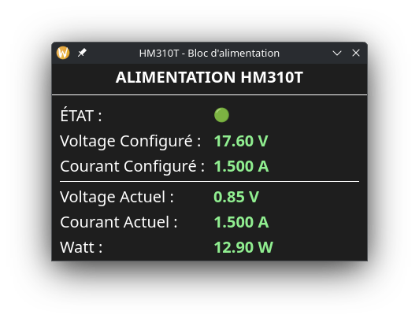

# HM310T - Interface Graphique Python

🇫🇷 Interface graphique en temps réel pour le bloc d’alimentation **Hanmatek HM310T**, écrite en Python avec **PyQt6**.  
🇬🇧 Real-time graphical interface for the **Hanmatek HM310T** power supply, written in Python using **PyQt6**.

## 🇫🇷 Fonctionnalités / 🇬🇧 Features

- Connexion série via Modbus RTU  
- Affichage en direct de la tension et du courant configurés (Vset/Iset)  
- Affichage en direct de la tension, courant et puissance mesurés (Vout/Iout/Watt)  
- Thème sombre clair et épuré  
- Lecture intelligente de l’ampérage basé sur la valeur brute  
- Mise à jour toutes les 0.5 secondes  
- Configuration via `.env`

## 📦 Installation

### Cloner le projet / Clone the project

```bash
git clone https://github.com/sandmarq/HM310TSand.git
cd HM310TSand
```

### Créer un environnement virtuel / Create a virtual environment

```bash
python -m venv .venv
source .venv/bin/activate  # ou 'source .venv/bin/activate.fish' pour Fish
```

### Installer les dépendances / Install dependencies

```bash
pip install -r requirements.txt
```

## ⚙️ Configuration (.env)

Créez un fichier `.env` à la racine avec le contenu suivant :  
Create a `.env` file at the root with the following content:

```env
PORT=/dev/ttyUSB0
```

> 🇫🇷 Remplace `/dev/ttyUSB0` par le port série correspondant à ton appareil.  
> 🇬🇧 Replace `/dev/ttyUSB0` with the correct serial port for your device.

## ▶️ Lancer l'application / Run the application

```bash
python main.py
```

## 🐧 Dépendances Linux (si Qt ne se lance pas) / Linux Dependencies (if Qt doesn't start)

🇫🇷 Si vous avez une erreur Qt de type `Could not load the Qt platform plugin "xcb"` lors du démarrage de l'application, vous devez installer quelques bibliothèques système.  
🇬🇧 If you get a Qt error like `Could not load the Qt platform plugin "xcb"` when launching the app, you need to install some system libraries.

### 🔧 Pour Arch Linux, Manjaro, CachyOS, EndeavourOS :

```bash
sudo pacman -S libxcb xcb-util xcb-util-image xcb-util-keysyms xcb-util-renderutil xcb-util-wm libxkbcommon-x11 qt6-base xcb-util-cursor
```

### 🔧 Pour Debian, Ubuntu, Linux Mint :

```bash
sudo apt install libxcb-xinerama0 libxcb-cursor0 libxkbcommon-x11-0
```

## 🖼️ Aperçu / Preview



## 📄 Licence

Ce projet est distribué sous la licence MIT.  
This project is licensed under the MIT License.

## 🤝 Contribuer / Contributing

Les contributions sont les bienvenues !  
Contributions are welcome! Fork, propose des améliorations ou rapporte un bug.
